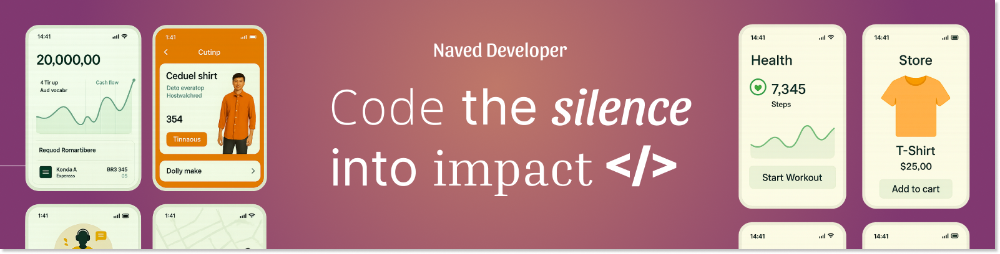

<!-- TODO: Banner -->

  

<h1 align="center">Hey 👋, I'm Naved Ansari</h1>

  💻 Software Developer | 📱 Flutter Craftsman | 🚀 Open Source Enthusiast

---

  

### 🧠 About Me

I'm a curious engineer who believes in **turning caffeine into code** ☕💻.  
I love solving real-world problems by building intuitive mobile apps and backend systems.

- 💼 Creator of **[FortifyNote](https://github.com/naveddeveloper/FortifyNote)** – a secure note-taking app
- 🛠 Tech stack: **Flutter**, **Dart**, **C++**, **Python**
- 🔐 Passionate about security, cloud, and buttery-smooth UIs
- ✍️ Blogger: [ansarinaved.vercel.app/blogs](https://ansarinaved.vercel.app/blogs)
- 🌱 Currently exploring **React**, design systems & clean architecture

---

### 🧰 Tech Toolbox

  

---

### 🚀 Featured Projects

<table>
  <tr>
    <td width="50%" valign="top">
      <h4>📱 <a href="https://github.com/naveddeveloper/FortifyNote">FortifyNote</a></h4>
      
A secure note-taking app with fingerprint/PIN authentication, rich-text editor, and cloud storage using Flutter & Appwrite.

    </td>
    <td width="50%" valign="top">
      <h4>📸 <a href="https://github.com/naveddeveloper/clarity_gallery">ClarityGallery</a></h4>
      
Photo/video gallery with albums, favorites, and private biometrics section. Built with Flutter + SQLite + UI animations.

    </td>
  </tr>
  <tr>
    <td width="50%" valign="top">
      <h4>🔍 <a href="https://github.com/naveddeveloper/QR_Code_Generator_App">MeshCode</a></h4>
      
Generate dynamic QR codes for websites, WiFi, text, and more — all in a slick Flutter UI.

    </td>
    <td width="50%" valign="top">
      <h4>📷 <a href="https://github.com/naveddeveloper/Camera-App-With-BarCode-Scanner">CamCascade</a></h4>
      
Camera app with QR scanning, photo/video capture, and orientation-fix gallery viewer.

    </td>
  </tr>
  <tr>
    <td width="50%" valign="top">
      <h4>🔐 <a href="https://github.com/naveddeveloper/flutter_auth_appwrite">QuickLogin</a></h4>
      
Authentication starter with Google, Twitter, Facebook, Apple logins + profile & secure local storage.

    </td>
    <td width="50%" valign="top">
      <h4>📦 <a href="https://github.com/naveddeveloper">More Projects</a></h4>
      
Check out my full collection of Flutter apps, experiments, and prototypes.

    </td>
  </tr>
</table>

  🔗 <a href="https://github.com/naveddeveloper?tab=repositories"><strong>Explore All Repositories →</strong></a>

---

### 📊 GitHub Stats

  
   
  
   
  

---

### 🌐 Let’s Connect

  
  
  
  
  
  
  
  
  

---

### ✨ Final Thought

> _“Your code is a story. Make it readable, maintainable, and meaningful.  
> I don’t just build apps — I craft experiences.”_

---

  

